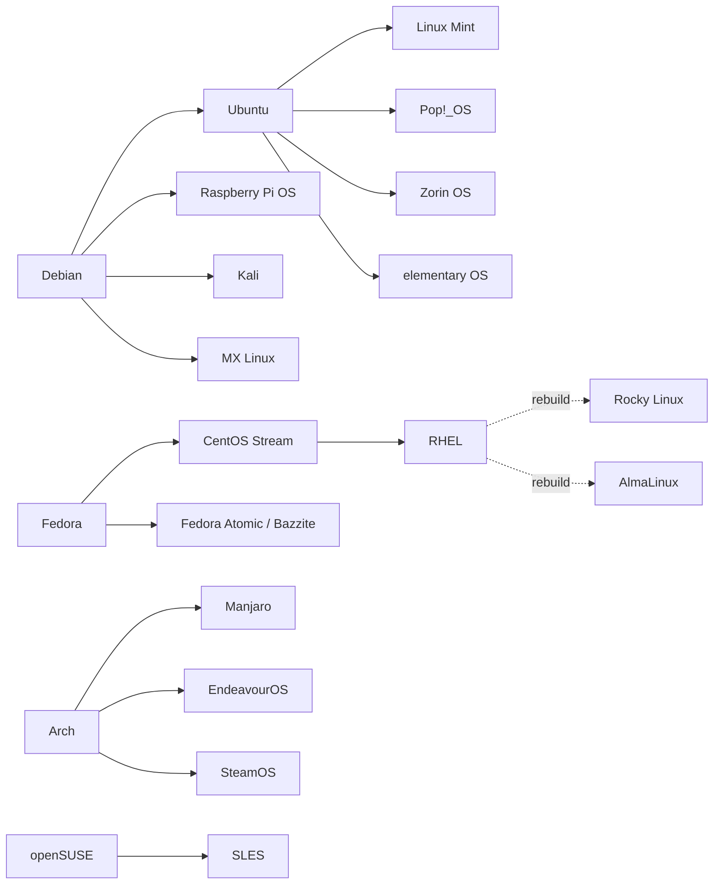

---
tags:
  - linux
---
# 02 - Distributions Overview

This note surveys the major Linux distributions: what actually makes them different, how they're related, and which ones fit which purpose.

> [!note] Recap
> A **distribution** is the Linux [[03 - Core Parts of a Distro#Kernel|kernel]] plus everything needed to make a usable OS: tools, libraries, a [[03 - Core Parts of a Distro#Package Manager|package manager]], defaults, an installer and a support policy. See [[01 - What is Linux#Kernel vs. Distribution|Kernel vs. Distribution]].

## What Actually Distinguishes Distros

Almost every distro runs the same kernel, the same browsers and the same desktops. The real differences are these:

| Axis | What varies | Examples |
|---|---|---|
| **Package format and manager** | How software is installed and updated | `.deb`/apt, `.rpm`/dnf, pacman, zypper, apk, nix |
| **Release model** | How often and how big the updates are | Fixed releases vs. rolling |
| **Support length** | How long a release gets security fixes | 9 months to 10+ years |
| **Defaults** | Desktop, filesystem, [[03 - Core Parts of a Distro#Init System\|init system]], C library | GNOME vs. KDE, ext4 vs. btrfs, systemd vs. OpenRC, glibc vs. musl |
| **Philosophy** | Free software only, or pragmatic about proprietary drivers and codecs | Debian's main repo (free only) vs. Ubuntu's "restricted" drivers |
| **Target user** | Hand-holding vs. DIY | Mint vs. Arch |
| **Backing** | Company vs. community | Ubuntu (Canonical), Fedora/RHEL (Red Hat), Debian (volunteers) |
| **System model** | Traditional (mutable) vs. image-based (atomic/immutable) | Ubuntu vs. Fedora Silverblue |

> [!tip] Distro ≠ desktop
> The look of a distro mostly comes from its [[03 - Core Parts of a Distro#Desktop Environment and Window Manager|desktop environment]], and you can install another one on almost any distro. Kubuntu, Xubuntu and Lubuntu are all **Ubuntu** with KDE, Xfce and LXQt respectively. Same base, same packages, different desktop. Don't pick a distro just for its screenshots.

### Release models

| Model | How it works | Pros | Cons | Examples |
|---|---|---|---|---|
| **Fixed / point release** | Versioned snapshots; within a release you get security and bug fixes only | Predictable, stable | Software ages until the next release | Debian, Ubuntu, Fedora, Mint |
| **LTS (Long-Term Support)** | A fixed release supported for many years | Set-and-forget servers | Increasingly old software | Ubuntu LTS, RHEL, Debian stable |
| **Rolling** | No versions; packages update continuously | Always the latest software | More frequent breakage; needs attention | Arch, openSUSE Tumbleweed, Gentoo, Void |
| **Semi-rolling / curated rolling** | Rolling, but held back and tested before release | Middle ground | Can lag behind upstream fixes | Manjaro |
| **Atomic / immutable** | The system is a read-only image, updated as a whole with rollback | Very hard to break; easy rollback | Changing the base system works differently | Fedora Silverblue/Kinoite, Bazzite, SteamOS, NixOS (declarative) |

> [!important] "Stable" means "unchanging", not "never crashes"
> In distro language, **stable** means software versions are frozen for the life of the release. Debian stable ships deliberately older versions because they've been tested together for a long time. It doesn't mean newer software on Fedora or Arch is "unstable" in the everyday sense.

## Distro Families

Most distros are **derivatives** of a small number of bases and inherit that base's package format and tooling. Once you know a family, you know most of its members.

| Family | Package format | Package manager | Members |
|---|---|---|---|
| **Debian** | `.deb` | `apt` (low level: `dpkg`) | Debian, Ubuntu, Mint, Pop!_OS, Zorin, elementary, Kali, Raspberry Pi OS |
| **Red Hat** | `.rpm` | `dnf` (low level: `rpm`) | Fedora, CentOS Stream, RHEL, Rocky, AlmaLinux, Oracle Linux, Amazon Linux |
| **Arch** | `.pkg.tar.zst` | `pacman` (+ AUR helpers) | Arch, Manjaro, EndeavourOS, SteamOS, CachyOS |
| **SUSE** | `.rpm` | `zypper` | openSUSE Tumbleweed, openSUSE Leap, SUSE Linux Enterprise |
| **Independent** | various | various | Gentoo (`emerge`), Alpine (`apk`), Void (`xbps`), NixOS (`nix`), Slackware |

The day-to-day commands for each package manager are in [[04 - Essential Commands#Package Management|Essential Commands → Package Management]].

> [!info]- How Fedora, CentOS Stream and RHEL relate (often misunderstood)
> 1. **Fedora**: fast-moving community distro where new technology lands first.
> 2. **CentOS Stream**: a snapshot of Fedora becomes the development branch of the next RHEL. Stream is just *ahead* of RHEL. It's where RHEL's next minor update is built.
> 3. **RHEL**: the commercial, 10-year-supported product.
> 4. **Rocky Linux / AlmaLinux**: free rebuilds that aim to be compatible with RHEL.
>
> **Classic CentOS Linux** (a free 1:1 copy of RHEL) **no longer exists**: CentOS 8 ended in 2021 and CentOS 7 in June 2024. Rocky and Alma were created to fill that gap. "CentOS" today means CentOS Stream, which sits *upstream* of RHEL rather than downstream.

## Distros by Purpose

### Beginner-friendly

Goal: works out of the box, graphical tools for everything, big community for help.

| Distro | Based on | Default desktop | Why beginners like it |
|---|---|---|---|
| **Linux Mint** | Ubuntu LTS (also LMDE, based on Debian) | Cinnamon (also Xfce, MATE) | Familiar Windows-like layout, conservative, great update manager |
| **Ubuntu** | Debian | GNOME (customised) | Largest community; most tutorials target it; hardware vendors test on it |
| **Zorin OS** | Ubuntu LTS | GNOME (customised) | Layouts that mimic Windows or macOS; aimed at Windows switchers |
| **Pop!_OS** | Ubuntu LTS | COSMIC (System76's Rust-based desktop) | Easy NVIDIA setup, tiling built in; good for developers and gaming |
| **elementary OS** | Ubuntu LTS | Pantheon | Polished, macOS-like design and curated app centre |
| **Fedora Workstation** | Independent (Red Hat family) | GNOME (vanilla) | Modern and polished; less hand-holding with proprietary drivers and codecs |

### Stability-focused

Goal: things don't change underneath you. Good for servers, lab machines and "I just need it to work".

| Distro | Support per release | Notes |
|---|---|---|
| **Debian stable** | ~5 years (3 regular + 2 LTS) | Community-run, famously conservative, huge repository. A new release roughly every 2 years |
| **Ubuntu LTS** | 5 years standard; 10+ with Ubuntu Pro (free for personal use on a few machines) | An LTS every 2 years (April of even years: 22.04, 24.04, 26.04) |
| **openSUSE Leap** | Shares its core with SUSE Linux Enterprise | Strong admin tooling (YaST historically), btrfs snapshots |
| **Rocky / AlmaLinux** | ~10 years | RHEL-compatible; see [[#Enterprise]] |

### Power-user

Goal: control, the latest software, learning how the system works.

| Distro | Model | What distinguishes it |
|---|---|---|
| **Arch Linux** | Rolling | You build the system up from a minimal base. The **Arch Wiki** is the best Linux documentation anywhere, useful even on other distros. The **AUR** holds community build scripts for almost any software |
| **EndeavourOS** | Rolling (Arch) | Arch with a graphical installer and sane defaults; uses Arch's own repos |
| **Manjaro** | Semi-rolling | Arch-based, but with **its own repos** held back ~weeks for testing |
| **openSUSE Tumbleweed** | Rolling | Every snapshot is automatically tested (openQA); btrfs + snapper lets you roll back a bad update from the boot menu |
| **Fedora** | Fixed, ~6-month releases, ~13 months support each | Cutting-edge but polished; often the first to adopt new tech (Wayland, PipeWire, btrfs) |
| **Gentoo** | Rolling, source-based | Compiles everything from source with `USE` flags to toggle features. Maximum control, long build times |
| **NixOS** | Declarative | The entire system is described in one config file (`configuration.nix`). Every change creates a bootable "generation" you can roll back to |
| **Void Linux** | Rolling | Independent; uses **runit** instead of systemd; optional musl C library |

### Enterprise

Goal: long, predictable support that businesses can depend on.

| Distro | Vendor | Notes |
|---|---|---|
| **Red Hat Enterprise Linux (RHEL)** | Red Hat (IBM) | The industry standard. 10-year life cycle, certifications, paid support. Free developer subscription available |
| **SUSE Linux Enterprise (SLES)** | SUSE | Strong in Europe, SAP workloads, mainframes |
| **Ubuntu Server + Ubuntu Pro** | Canonical | Dominant in the cloud; Pro adds extended security maintenance |
| **Rocky Linux / AlmaLinux** | Community foundations | Free RHEL-compatible rebuilds |
| **Oracle Linux** | Oracle | RHEL-compatible, optional own kernel (UEK) |
| **Amazon Linux** | AWS | Tuned for EC2; Fedora-based |

What "enterprise" actually buys you:
- **Long life cycles** (10+ years) and a guarantee that software APIs/ABIs won't change within a major release.
- **Backported security fixes**: the fix is applied to the *old* version instead of upgrading the software.
- **Certifications** (hardware, software vendors, government standards) and **someone to call** when production breaks.

> [!warning] Old version number ≠ vulnerable
> RHEL or Debian might ship `openssh 8.7` years after upstream released 9.x. A vulnerability scanner that only compares version numbers will flag it, but the distro has usually **backported** the security fix into its 8.7 package. Check the distro's security tracker (e.g. `security-tracker.debian.org`, Red Hat's CVE database) rather than the upstream version number.

### Specialized

| Distro | Purpose | Notes |
|---|---|---|
| **Kali Linux** | Penetration testing / security auditing | Debian-based, preloaded with hacking tools. **Not meant as a daily-driver desktop** |
| **Parrot OS** | Security + privacy | Kali alternative, somewhat more usable as a desktop |
| **Tails** | Anonymity | Boots from USB, routes everything through Tor, forgets everything on shutdown (amnesic) |
| **Qubes OS** | Security by isolation | Uses the Xen hypervisor to run each task in a separate VM (Fedora/Debian templates) |
| **Alpine Linux** | Containers, tiny systems | ~5 MB base image; musl + BusyBox + OpenRC. The most common Docker base image |
| **Raspberry Pi OS** | Raspberry Pi boards | Debian-based, ARM builds |
| **SteamOS** | Steam Deck / gaming handhelds | Arch-based, read-only root, gaming-mode UI |
| **Bazzite** | Gaming desktop/handheld | Fedora Atomic image with gaming drivers and tools preinstalled |
| **Fedora Silverblue / Kinoite** | Immutable desktop | Read-only base image (GNOME / KDE); apps via Flatpak; atomic updates and rollback |
| **Ubuntu Core** | IoT / embedded | Everything is a snap, including the kernel; transactional updates |
| **Proxmox VE** | Virtualisation host | Debian-based hypervisor (KVM + LXC) with a web UI |
| **TrueNAS SCALE** | Network storage | Debian-based NAS OS built around ZFS |
| **Lightweight distros** (antiX, Lubuntu, Puppy) | Old or low-RAM hardware | Light desktops (LXQt, IceWM), minimal services |

## Choosing a Distro

| If you want… | Try |
|---|---|
| Your first Linux desktop, minimal friction | Linux Mint, Ubuntu, Zorin OS |
| A modern desktop for development | Fedora Workstation, Pop!_OS, Ubuntu |
| To learn how Linux fits together | Arch (manual install once), or Gentoo if you're patient |
| Gaming | Bazzite, Pop!_OS, or any current distro with Steam + Proton |
| A home or personal server | Debian stable, Ubuntu Server LTS |
| A job in enterprise IT / sysadmin certs (RHCSA) | Rocky / AlmaLinux / RHEL (free developer subscription) |
| Containers | Alpine, Debian slim, or distroless images |
| An old laptop | Lubuntu, Xubuntu, MX Linux, antiX |

> [!tip] Try before installing
> Almost every distro offers a **live USB** you can boot without installing. Also try distros in a virtual machine (VirtualBox, GNOME Boxes, virt-manager) or in **WSL** on Windows. Tools like **Ventoy** let one USB stick hold many ISO files.

## Common Mistakes

> [!warning] Common Mistakes
> - **Choosing by screenshots.** The desktop can be changed. Choose by base, release model and community.
> - **Distro-hopping instead of learning.** Most skills are the same across distros. Constantly reinstalling teaches installers, not Linux.
> - **Using Kali as an everyday OS.** It's a toolbox for security testing, not a hardened or general-purpose desktop.
> - **Mixing repositories.** Adding Debian repos to Ubuntu (or Fedora repos to RHEL) creates a "FrankenDebian" and dependency hell. Be careful with random PPAs and third-party repos too.
> - **Partial upgrades on Arch.** Running `pacman -Sy package` (refresh without upgrading) and then installing can leave libraries out of sync. Always `pacman -Syu`.
> - **Using AUR packages on Manjaro without thinking.** The AUR targets *current Arch* repos; Manjaro's delayed repos can make AUR builds fail or break.
> - **Assuming derivatives inherit everything.** Linux Mint is Ubuntu-based but **blocks Snap** by default. Ubuntu's `apt install firefox` actually installs the **Snap** version via a transitional package.
> - **Following a tutorial written for another family.** An `apt` command won't work on Fedora; find the `dnf` equivalent.

## Practice

**1.** You need to deploy a server that should run for 8 years with only security updates and no major upgrades. Which distros fit?

> [!success]- Solution
> **RHEL / Rocky / AlmaLinux** (10-year life cycles) or **Ubuntu LTS with Ubuntu Pro** (extended security maintenance to 10+ years). SLES also fits. **Debian stable** gets ~5 years (including Debian LTS), so it would need one major upgrade. Rolling distros like Arch or Tumbleweed are the wrong model entirely.

**2.** Which of these is actually a different operating system from the others: Ubuntu, Kubuntu, Xubuntu, Pop!_OS?

> [!success]- Solution
> Ubuntu, Kubuntu and Xubuntu are **official Ubuntu flavours**: the same distro, same repos, different default desktop (GNOME, KDE Plasma, Xfce). **Pop!_OS** is a separate **derivative** made by System76: Ubuntu-based, but with its own repositories, kernel packaging and COSMIC desktop. So Pop!_OS is the "different" one, though even it shares Ubuntu's base.

**3.** You copy a program compiled on Ubuntu into an `alpine` Docker container. Running it gives `sh: ./app: not found`, even though `ls` clearly shows the file. What's going on?

> [!success]- Solution
> The binary is **dynamically linked against glibc** and asks for the glibc dynamic loader (`/lib64/ld-linux-x86-64.so.2`). Alpine uses **musl**, so that loader doesn't exist. The "not found" refers to the **interpreter**, not your file. Fixes: build on Alpine, build a static binary, install the `gcompat` compatibility layer, or use a glibc-based image (e.g. `debian:*-slim`). See [[03 - Core Parts of a Distro#System Libraries|System Libraries]].

**4.** A security scanner reports that your Debian server runs `nginx 1.22`, which "has 5 known CVEs fixed in 1.24". Is the server vulnerable?

> [!success]- Solution
> **Not necessarily.** Debian stable **backports** security fixes into the version it shipped. Check the Debian security tracker for each CVE, or the package changelog (`apt changelog nginx`). The version string (e.g. `1.22.1-9+deb12u1`) includes a Debian revision that reflects the patches.

**5.** Is CentOS a free copy of RHEL?

> [!success]- Solution
> **Not any more.** The old *CentOS Linux* was, but it reached end of life (CentOS 8 in 2021, CentOS 7 in 2024). Today's **CentOS Stream** is the development branch **ahead** of RHEL. For a free RHEL-compatible system, use **Rocky Linux** or **AlmaLinux**.

**6.** You installed a package on SteamOS with `sudo pacman -S htop` (after unlocking the read-only filesystem). After the next system update it's gone. Why?

> [!success]- Solution
> SteamOS is an **image-based (immutable)** system: updates replace the whole root filesystem image, so manual changes to it are wiped. On atomic systems, install apps as **Flatpaks**, in your home directory, or inside a container (Distrobox). Changes to the base image are meant to go through the vendor's image.

## Related

- [[00 - Index]]
- [[01 - What is Linux]]: kernel vs. distribution
- [[03 - Core Parts of a Distro]]: the layers every distro assembles
- [[04 - Essential Commands#Package Management|Package management commands]] across the families
